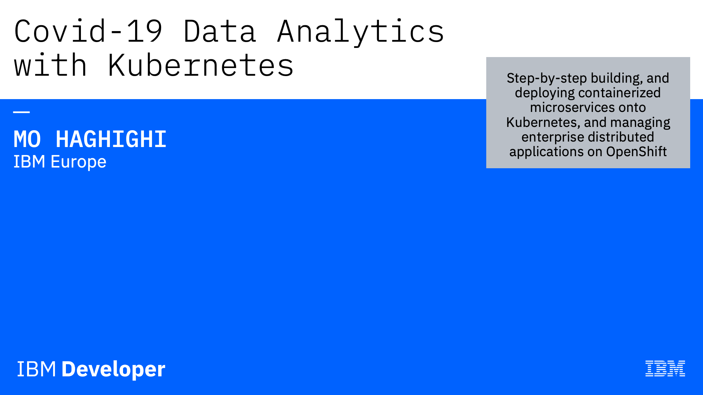
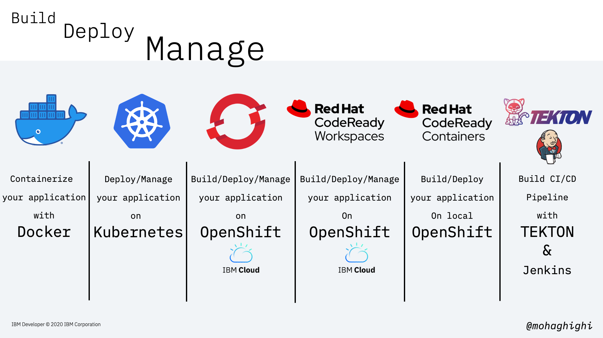

# Covid-19 Data Analytic Microservices Application with Kubernetes and OpenShift

{style="width: 50%" .center}

We have seen a range data published on the impact of various parameters on the spread of covid-19, including population density, average number of people per household, ethnicity, weather data etc.
Have you ever wanted to run your own analytics on covid-19 data, and examine data sets in order to draw a particular conclusion? Or possibly evaluate a theory, that may or not may not be true. Such analytics could potentially shed light on the impacts of various factors, and you can apply them to a variety of problems.

Maybe you'd like to see the impact of temperature and humidity on the spread of covid-19 in different countries?  

This is a multipart workshop series on building, deploying and managing microservices applications with Kubernetes and openshift.

Our workshop series is around covid-19 data retrieval, parsing and analytic. This is a series of 7 x hands-on workshops, teaching you how to retrieve covid-19 data from an authentic source, make them securely available through REST APIS on kubernetes and Openshift.

The primary applications are developed in Java Spring Boot, but we will add more features and apply analytical services on the data in the form of microservices written in different programming languages.

## Watch the full series on YouTube!

| [{style="width: 90%"}](https://youtu.be/j1jLtp4_6Kg) | [{style="width: 90%"}](https://youtu.be/RMe2S30Cggc) |
| :-------------: |:-------------:|
| `40 Minutes` | `50 Minutes` |
| [{style="width: 90%"}](https://youtu.be/zU7ReT8tZfo) | [{style="width: 90%"}](https://youtu.be/zU7ReT8tZfo) |
| `80 Minutes` | `125 Minutes` |

We highly recommend that you follow the workshops by watching the videos as they are hands-on and much more comprehensive than the instructions given here. All videos are available from the links above or directly from this YouTube [playlist](https://www.youtube.com/playlist?list=PLKBDkjUynCxj2DpjEAWfCsW88M473SWrg)

In this workshop series, we will firstly take a look at the key features of our application and how it was developed in microsevices architecture. We'll then explore ways to contianerise our application with Docker. in Lab 3, We'll deploy and manage our application with Kubernetes. In Part 4, we'll deploy our application onto Openshift on IBM Cloud using OpenShift CLI tool and Web Console. In Lab 6, we'll set up a CodeReady Workspace to share an instance of workspace with others with ero configuration on the recipient side. In Lab 7, We'll build and test out application on a local version of Openshift Cluster, CodeReady containers. Finally, in part 8 we'll automate our CI/CD pipeline to push our code into production with zero downtime.

As a reminder, all the steps taught in this course are generic and applicable to application developed in any programming languages or platforms. but to simplify our journey and making it more use-case oriented, our course is designed around a covid-19 data analytic application.

At the beginning of every part, we take a quick look at our application. This is to
showcase the end result of what we do together in every part with respect the primary subject of each part.

Our application also comes with a frontend [User Interface](https://github.com/mohaghighi/Covid19-UI.git) that connects to our parsers and invokes the API endpoints to display data and showcase the power of microservices running as conainers on Kubernetes and Openshift.

This application has been designed as a template for designing your own analytical microservices and deploying onto Kubernetes.

This workshop series will be focused on:

[Part 1: Cloud Native Development, Microservices and the Architecture of our Covid-19 Data Parser](part1.md)  
[Part 2: Build your Microservice container with Docker](part2.md)  
[Part 3: Deploy and manage your application with Kubernetes](part3.md)  
[Part 4: Deploy and manage your application with OpenShift on IBM Cloud](part4.md)
[Part 5: Build, Deploy and Share with CodeReady Workspaces](part5.md)  
[Part 6: Build and Test your application with CodeReady Containers](part6.md)  
[Part 7: Build your CI/CD pipelines with Jenkins and Tekton](part7.md)  

Here is what you will learn by the end of this workshop series:  
  
{style="width: 80%" .center}
