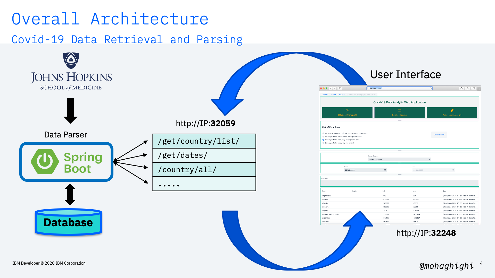
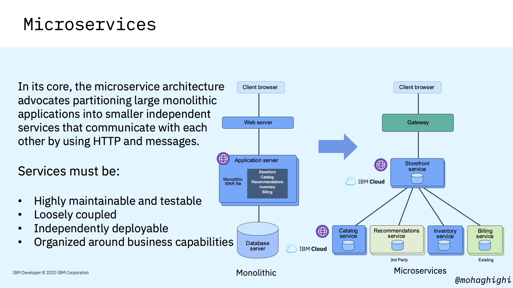

# Part 1: Cloud Native Development, Microservices and the Architecture of our Covid-19 Data Parser  

[{style="width: 80%" .center}](https://youtu.be/j1jLtp4_6Kg)

## Agenda
In this section you will learn:

An overview of Covid-19 data analytic web application

- Quick summary
    - Data source & format
    - Data Parser
    - REST APIs endpoints
- Microservices
    - Why microservices?
    - Orchestration with Kubernetes
  
{style="width: 80%" .center}

Our application has been developed in Java and Spring Boot framework. It provides 
us with a number of API endpoints for retrieving covid-19 data per region, country, 
dates and periods. 
It comes with a number of containerised microservices, 
including 2 x data parsers for positive cases and mortality rates per country, and a User 
Interface for displaying data, as well as invoking those APIs through a number of sample 
functions. 

{style="width: 80%" .center}

As you can see from the slide, data is fetched from Johns Hopkins University's repo (which is an authentic source of covid-19), and is stored in our local data repository.  
Here is a list of sample API endpoints as we'll test them out shortly. 
{style="width: 80%" .center}

## Prerequisites

Spring Boot v2.2 - https://spring.io/guides/gs/spring-boot/ 

OpenJDK v11 - https://openjdk.java.net/install/ 

(Optional) Apache Netbeans IDE v12 - https://netbeans.apache.org/download/ 

Node.js v14 - https://nodejs.org/en/download/ 

Docker Latest - https://docs.docker.com/engine/install/ 

Minikube Latest - https://kubernetes.io/docs/tasks/tools/install-minikube/ 

CodeReady Containers - https://developers.redhat.com/products/codeready-containers 

(Optional) OpenShift v4.3 on IBM Cloud - https://www.ibm.com/cloud/openshift 

!!! note
    You also need a laptop with a modern operating system (Linux, MacOS or Windows) with at least 16GB memory

## Microservices

{style="width: 80%" .center}

{style="width: 80%" .center}

By the end of this series, you'll have a microservices application with 4 x containers running in your Kubernetes/OpenShift cluster.

{style="width: 80%" .center}

- Data Parser written in Java.
- UI frontend written in Java to generate HTML and Node.js.
- Analytical application wrtittn in Python Flask.  
- Data Visulization application written in Node.js
