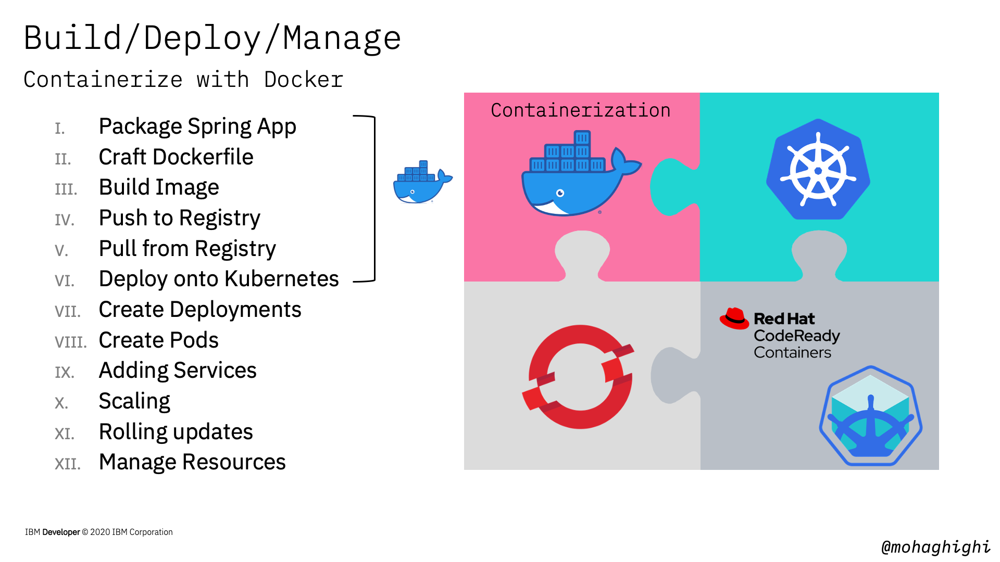
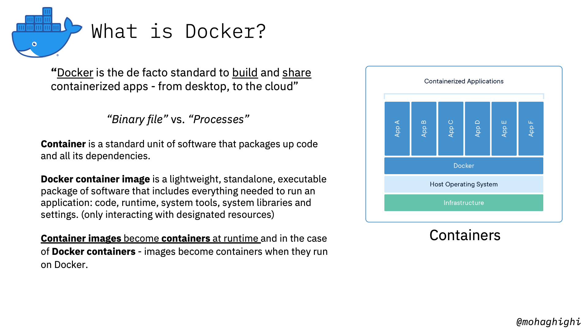
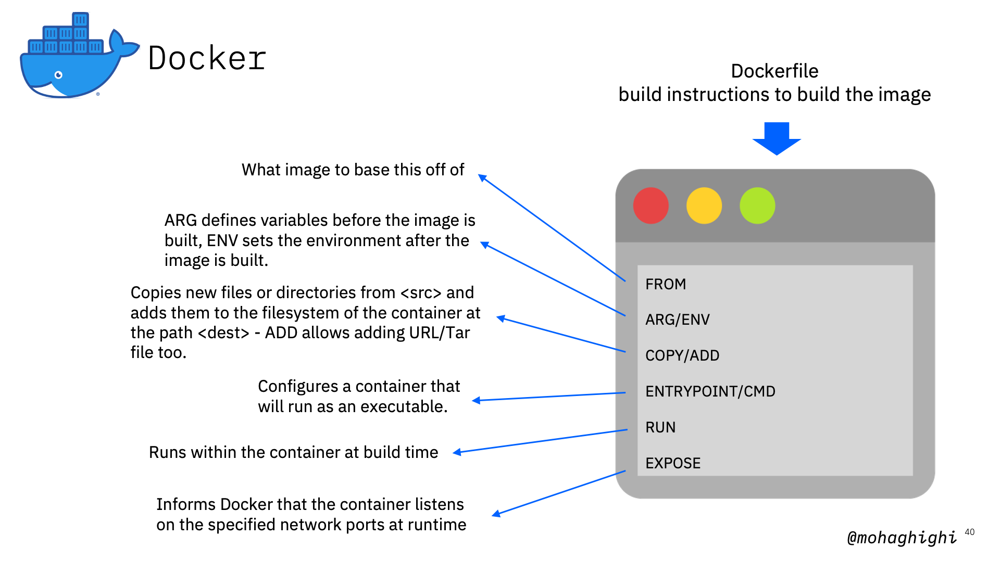
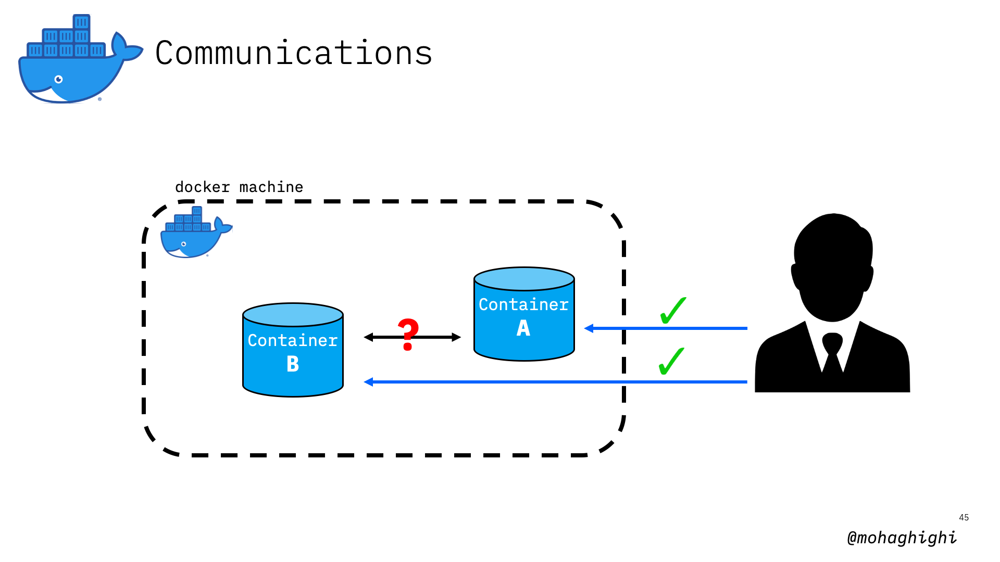
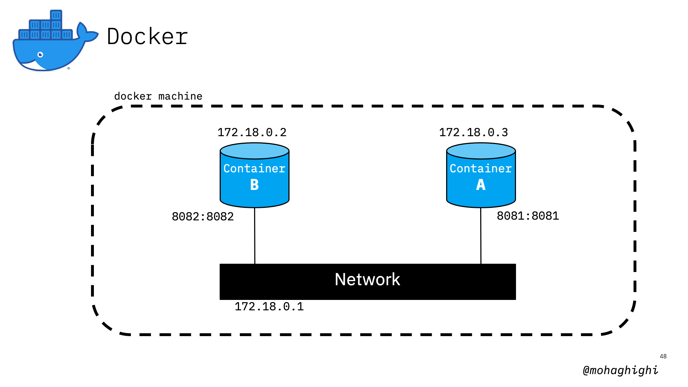
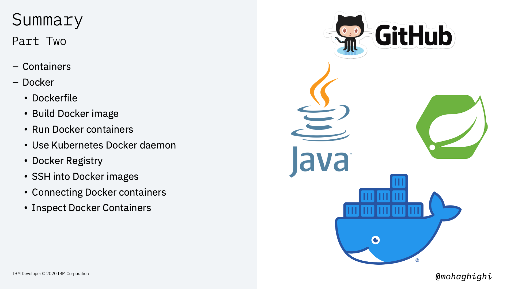

# Part 2: Build your Microservice container with Docker

[{style="width: 80%" .center}](https://youtu.be/RMe2S30Cggc)

Here's a quick look at what you're going to learn throughout this workshop series - and how Docker fits into our learning journey.  In this lab you'll learn about containers, the basics of containerising microservices with Docker, how to run and connect docker containers and best practices for building docker images based on your application services' requirements.  


In this lab, we'll containerise our application's microservices with Docker, and in the next lab, we'll deploy and manage them with Kubernetes. Later we'll use openshift to automate the entire process of containerising, deployment, scaling and management with a few clicks from the openshift web console.  
  
## Agenda

In this section you will learn:

- Install/download prerequisites
- Package Java Maven application
- Test Java application
- Docker
    - Dockerfile
    - Build Docker image
    - Run Docker containers
    - Use Kubernetes Docker daemon
    - Docker Registry
    - SSH into Docker images
    - Connecting Docker containers
    - Inspect Docker Containers

{style="width: 80%" .center}
  
In the previous labs, we broke down our application into several microservices based on their functionalities and purposes, and in this lab we'll containerise them with Docker, and use docker to run them.

Therefore, we convert our monolithic application into a multi-container application.

If you want to review how this application has been designed and how microservices architecture optimised it, please refer to the previous workshop.

You may ask why Docker?

Well, Modern application development and app modernisation techniques consist of three important stages of Build, Deploy and Manage.

Docker plays a vital role in the build stage, and even partially the deployment phase.

As you can see from this slide, for stages we're going to follow in this workshop series, Docker is responsible for all initial steps.

{style="width: 80%" .center}
  
Let's start by clining the repos and packaging our Java application with Maven:

## Clone The Repositories

``` bash
git clone github.com/mohaghighi/covid19-web-application
git clone github.com/mohaghighi/covid19-UI
```

## Package Spring Boot with Maven

```bash
./mvnw clean install
```

Run the jar file to test the Spring Boot application:

```bash
java -jar target/[filename].jar
```

Data Parser runs on port 8082. if you want to change th *Port Number*, you need to edit ***"application.properties"*** file under src/main/java/resources/

```bash
curl http://localhost:8082
```

Now we've ogot our application ready to be containerised with Docker. Before we dive deeper into Docker, let's explore what containers are and how docker fits in containerisation technology.  

### What is a container?

> Containers are executable units of software in which application code is packaged, along with its libraries and dependencies, in common ways so that they can be run anywhere, whether it be on desktop, traditional IT, or the cloud.

## What is Docker?

> “Docker is the de facto standard to build and share containerized apps - from desktop, to the cloud”

You may ask why Docker?

Modern application development and app modernisation techniques consist of three important stages of Build, Deploy and Manage.

Docker plays a vital role in the build stage, and even partially the deployment phase.

As you can see from this slide, for stages we're going to follow in this workshop series, Docker is responsible for all initial steps.

## Technology vs. Toolkit

containers have been around for quite some time, and developers can create containers without Docker --  but Docker makes it easier, simpler, and safer to build, deploy, and manage containers. Docker is essentially the first toolkit that due to its simplicity, enabled all developers to build, deploy, run, update, and stop containers using simple commands and work-saving automation.

{style="width: 80%" .center}

## Docker Image vs. Docker Container

> Docker container image is a lightweight, standalone, executable package of software that includes everything needed to run an application: code, runtime, system tools, system libraries and settings. (only interacting with designated resources)

> Container ****<ins>images become containers at runtime</ins>**** and in the case of Docker containers - images become containers when they run on Docker.  

So let's get started and build our first container image with Docker.

> The first step is to craft our dockerfile and the Dockerfile is essentially the build instructions to build the image.

{style="width: 80%" .center}

### What is a Dockerfile?

A set of build instructions to build the image in a file called "dockerfile".

### Craft your Dockerfile

{style="width: 80%" .center}

The first part is the FROM command, which tells docker what image to base this off of. The FROM instruction sets the Base Image for subsequent instructions. It'll start by pulling an image from the Public Repositories.

ARG defines instructions to define variables. ENV is similar to ENV but mainly meant to provide default values for your future environment variables. ARG values are not available after the image is built.  

The COPY instruction copies new files or directories from <src\> and adds them to the filesystem of the container at the path <dest\>.  It can copy a file (in the same directory as the Dockerfile) to the container

The ADD instruction copies new files, directories or remote file URLs from <src\> and adds them to the filesystem of the image at the path <dest\>.  

The ENV instruction sets the environment variable <key\> to the value <value\>.  

This is what runs within the container at build time. The RUN instruction will execute any commands in a new layer on top of the current image and commit the results.  

An ENTRYPOINT allows you to configure a container that will run as an executable.

!!! note
    should add '&' to run in the background

[Entry Point/CMD] ENTRYPOINT instruction allows you to configure a container that will run as an executable. It looks similar to CMD, because it also allows you to specify a command with parameters. The difference is ENTRYPOINT command and parameters are not ignored when Docker container runs with command line parameters.

The EXPOSE instruction informs Docker that the container listens on the specified network ports at runtime. The EXPOSE instruction does not actually publish the port. It functions as a type of documentation between the person who builds the image and the person who runs the container, about which ports are intended to be published.

In the case of our Data Parser Spring Boot application:

``` dockerfile
FROM adoptopenjdk/openjdk11:latest
ARG JAR_FILE=target/*.jar
COPY ${JAR_FILE} app.jar
ENTRYPOINT ["java","-jar","/app.jar"]
```

Dockerfile for Node.js application:

``` dockerfile
FROM node:12
COPY package*.json ./
RUN npm install
ENTRYPOINT [”node",”app.js"]
```

Dockerfile for Python application:

``` dockerfile
FROM python:3
COPY package.py ./
RUN pip install pystrich
ENTRYPOINT [”python",”./app.py"]
```

save the file as <ins>dockerfile</ins> with no file extension.

## Building Docker Image from the Dockerfile

```bash
docker build -t [image name:v1] [path]
```

in this case, let's call it myapp:v1

```bash
docker build -t myapp:v1 .
```

let's take a look at our docker images:

``` bash
docker images
```

our image must be listed there.  

now let's a look at running containers:

``` bash
docker ps
```

if you add -al, you can view all running and stopped containers

``` bash
docker ps -al
```

Here's the command for running the docker container

``` bash
docker run -p [PortHost:PortContainer] [imageName] -d --rm
```

Now let's go ahead and run our container on port 8082:

``` bash
docker run -p 8082:8082 myapp:v1 -d
```

-d and --rm flags will respectively run the docker in detached, mode and replace an existing docker image of the same name with the name one.  
We can ping the application by invoking the /hello/ REST endpoint:

``` bash
curl localhost:8082/hello/
```

### Build and Run the UI App

The UI application can be retrieved from here:
<https://github.com/mohaghighi/Covid19-UI.git>

Now let's build the UI app and call it myui:v1
Dockerfile is the same as the one we used for Data Parser app but changing the name to ***"myui"***

```bash
docker build -t myui:v1 .
```

> in case you haven't run the maven build and packaged the UI App, run this where mvnm file is located

``` bash
./mvnm clean install
```

Now let's run the UI app on port 8081:

``` bash
docker run -p 8082:8082 myapp:v1 -d
```

Open your browser and navigate to

``` bash
localhost:8081
```

From the UI, click on connect on the top left hand corner and enter:

``` text
http://localhost:8082
```

As you may have seen, you got an error indicating that the server is not responding.  There reason is, we can connect to containers directly through Docker, but docker containers cannot discover or communicate with each other.

{style="width: 80%" .center}

now let's try to ssh into our one of the docker containers and try to connect to the other one to identify the problem.
To simulate the issue that we've just expereinced with the UI app, let's ssh into our UI and try to connect to our data parser from within that container.

{style="width: 80%" .center}

``` bash
docker exec [container name/ID] -it
```

Here how we ssh into UI app

``` bash
docker exec -it myui:v1 /bin/bash
```

Now let's connect from within the container and see if it works

``` bash
curl localhost:8082/hello/
```

As you can see that doesn't work either.  
> containers need to be connected to the same network in order to communicate with each other

You can inspect your container to investigate the matter by looking for the network within both containers.

``` bash
docker inspect [container name]
```

As you can see our UI and Parser apps are not part of the same network.

{style="width: 80%" .center}

Let's create a network and instruct our containers to connect to it

``` bash
docker network create test
```

let's stop our docker containers:

``` bash
docker stop [container id]
```

Let's run our containers again, this time instructing them to join the new network we've just created

``` bash
docker run -p [PortHost:PortContainer] [imageName] --net=test
```

Run UI application on test network:

``` bash
docker run -p 8081:8081 myui:v1 --net=test
```

Run parser application on test network:

``` bash
docker run -p 8082:8082 myapp:v1 --net=test
```

Let's inspect our containers again and get their IP addresses based on their new network

``` bash
docker inspect [container name/ID]
```

if we try to ping our applications again, they should work fine.  
Go ahead and connect to the parser form the UI app to verify that.

In the next part we will be using minikube to spin up a single node kubernetes cluster. If we build all our images on your host docker machine, it'd be quite difficult to transfer your images from your host into minikube.

one solution is to use minikube's docker daemon to build your docker images.

> you need to set your environmental parameter to use miinkube docker. This command will let you do that:

``` bash
eval $(minikube docker-env)
```

This step is not needed here, is intended to let you know what we will use minikube's docker.

## Summary

{style="width: 80%" .center}
