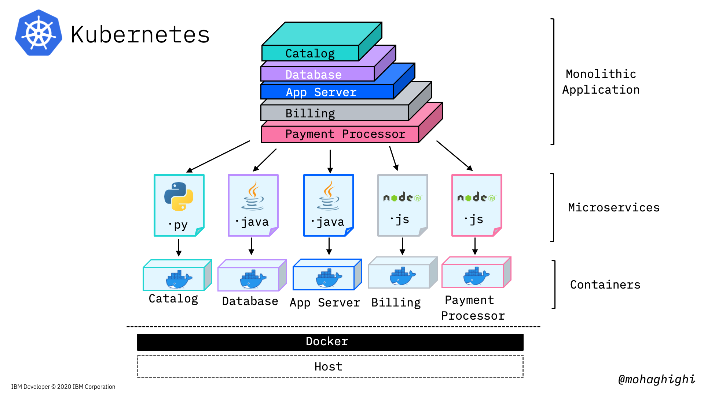
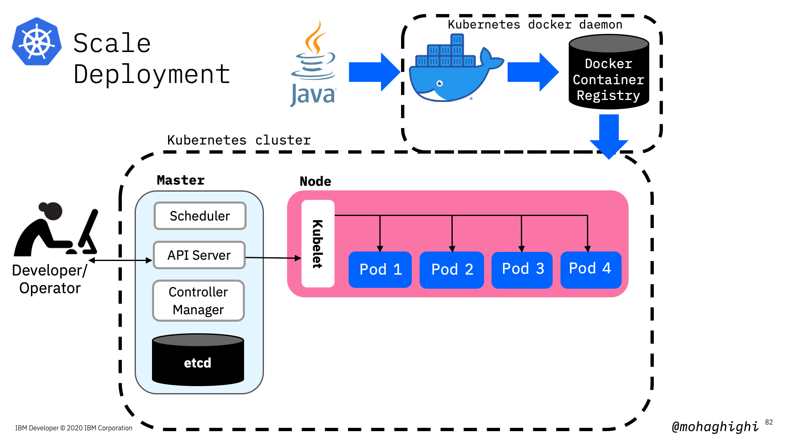

# Part 3: Deploy, Run and Maange your Docker Containers with Kubernetes

[{style="width: 80%" .center}](https://youtu.be/RMe2S30zU7ReT8tZfoCggc)
  
## Agenda
In this section you will learn:

- Why Kubernetes
- Kubernetes concepts/components
- Deploy on Kubernetes 
    - Minikube
    - Pulling image from registry
    - Create deployment
    - Expose deployment
    - Create services
- Manage with Kubernetes
    - Replicasets
    - Rolling out updates
    - Autoscaling

{style="width: 80%" .center}

## Kubernetes

Kubernetes is Greek for helmsman or pilot, hence the helm in the Kubernetes logo.

Imagine a ship full of containers like in this photo, and the helmsman is to make sure the ship sails smoothly through the oceans, and despite all the tides and waves, it makes it to the destination safely. the helmsman orders his crew to evenly distribute the containers around the ship in a way that, proper balance is struck, no one side is abnormally heavier, containers won't fall off, and the ship sails smoothly throughout the journey.

Just like the helmsman, Kubernetes looks after a large number of containerised applications, by orchestrating them according to the load, and the available underlying resources, making sure our system achieves minimum zero downtime and our applications are always up and running.

In the first and second labs we learned about the advantages and motivations for moving away from Monolithic applications and adopting microservices architecture.

## Quick reminder about Microservices architecture

Microservices architecture addresses all of the liabilities that are inherent in monolithic applications. 
microservices architecture allows

1. Different parts of our application to evolve on different timelines,
2. They can be deployed separately,
3. You choose your technology stack for each Microservice as it best fits the purpose,
4. You can scale your services dynamically at runtime. Or let's say you can create individual instances of each individual service.

But the most obvious advantage here is, if any part of the application fails, the whole application will not necessarily become unavailable/unresponsive to the customer, because they are not designed and operated as a single entity like in monolithic architecture.

## Microservices and Kubernetes

{style="width: 80%" .center}

In the previous labs, we broke down our application into several microservices and then containerised them with Docker and let docker run them. So we converted our application into a multi-container application in order to remove that single point of failure. But here 's the problem: Docker is running on a single host.

## Moving from Docker to Kubernetes

{style="width: 80%" .center}

And here we discuss why we need a containers orchestration platform like Kubernetes when moving from development to production.

a multi-container application must run on a multi-host environment in order to eliminate that single point of failure. If one host went down our orchestration tool can switch the load to another host. 

We need to be able to create new instances of our individual microservices containers to scale accordingly.

When one or more of our services need to be updated, or let's say we are adding a new service to our mix, the orchestration platform must be able to automatically schedule new deployments and create new instances of our containers with zero downtime.

{style="width: 80%" .center}

Kubernetes scales and manages our containers according to the available underlying resources on the host. Docker has a good view of what's happening to our containers, but not our host machine.

Last but not least, Kubernetes checks our container continually to make sure they're healthy, and in case of any failure, it'll take actions to reinstate our deployment, create new instances or restore the services.

## Understanding Deployment Scenario in Kubernetes

{style="width: 80%" .center}

Now let's take a look at a deployment scenario on a high level, how we are going to deploy our application onto Kubernetes.

We broke down our application, built docker containers, deploying each docker container will spin up a pod with its docker container in there. Based on our deployment scenario, and the load, each pod gets replicated (and that way we're making new instances of the docker containers) -these pods are inside a worker, which we are showing them for simplicity. so we first created a deployment, and then  scale our deployment accordingly. Next step is to create a service, which allows our applications communicate with each within the cluster and also exposes our application to the internet and external networks. If the service type is a load balancer, Traffic coming to our application will be directed to the pods accordingly through the load-balancer service.  

## Kubernetes Concepts/Resources:

**Pod**:Group of one or more containers with shared storage/network and a specification for how to run the containers in a shared context.

**Deployment**:A set of multiple, identical Pods with no unique identities. It runs multiple replicas of your application, and automatically replaces any failed instances.

**Node**:A virtual or a physical machine with multiple pods, where Master node automatically handles scheduling the pods across the Worker nodes in the cluster.

**Service**:An abstraction which defines a logical set of Pods and a policy by which to access them. Service enables external access to a set of Pods.

**Label**:Labels are key/value pairs that are attached to objects, such as pods.

**Namespace**:Logical isolation/partitioning of resources in kubernetes cluster.
  
Now that we know the key components, let's revisit our deployment scenario, this time in more details to see what's happening under the hood.

## Deployment under the hood

Firstly, we'll use KUBECTL CLI tool to interact with Kubernetes cluster. The kubectl lets you control Kubernetes clusters and its resources.

Think of kubectl as your magic keyword to instruct Kubernetes from your terminal.

{style="width: 80%" .center}
  
## Kubernetes Features:

- Automated rollouts and rollbacks
- Automatic scaling and load balancing
- Self-healing
- Service discovery
- Storage orchestration

Automated rolling out changes to a deployment and the ability to pause, resume and rollback to previous version if needed.

Automatic scaling and load balancing: When traffic to a container spikes, Kubernetes can employ load balancing and scaling to distribute it across the network to maintain stability.

Self-healing: When a container fails, Kubernetes can restart or replace it automatically; it can also take down containers that don't meet your health-check requirements.

Service discovery: Kubernetes can automatically expose a container to the internet or to other containers using a DNS name and IP address.  
And finally, provisioning local or cloud storage for your containers as needed.

## Prerequisites:

{style="width: 80%" .center}

In this part we are going to use minikube to spin up a single-node kubernetes cluster locally.

Here's the link to minikube on your machine:

``` text
https://kubernetes.io/docs/tasks/tools/install-minikube/
```
## What is minikube?
{style="width: 80%" .center}

### Spin up a Kubernetes cluster

``` bash
minikube start
```

### Start minikube by limiting the resources' utilization

``` bash
minikube start --memory=8192 --cpus=3 --kubernetes-version=v1.17.4 --vm-driver=virtualbox
```

### Get cluster information

``` bash
kubectl cluster-info  
```

### Get cluster configuration

``` bash
kubectl config view
```

## Useful commands through this section:

### Get the list of Pods

``` bash
kubectl get pods 
```

### Get the list of Deployments

``` bash
kubectl get deployment  
```

### Pause minikube

``` bash
kubectl pause minikube 
```

### Stop minikube

``` bash
kubectl stop minikube  
```

### Starting Kubernetes dashbaord

``` bash
kubectl minikube dashboard
```

### set minikube docker daemon

``` bash
eval $(minikube docker-env)
```

{style="width: 80%" .center}

### Verify you're using minikube's docker by looking up the images

``` bash
docker get images
```

## Useful Commands for Docker

### Getting the list of containers

``` bash
docker container List  
```

### Getting running docker containers

``` bash
docker ps  
```

## Deploying an Application

### Creating deployment with an image

``` bash
kubectl create deployment [label] --image= [Image Name]
```

### Getting details on deployment

``` bash
kubectl describe deployment/[deployment] 
```

### Getting logs for deployment

``` bash
kubectl get events 
```

## Scaling Applications

### creating instances of the application by setting the replicas

{style="width: 80%" .center}

### Creating replicas and the processes under the hood

{style="width: 80%" .center}

### Scale deployment and setting replicas

``` bash
kubectl scale deployment [Deployment Name] --replicas=4
```

### Enabling application to automatically scale

``` bash
kubectl autoscale deployment [deployment] --min=1 --max=8 --cpu-percent=80  
```

### Getting Info on Horizontal Pod Autoscaler 

``` bash
kubectl get hpa
```

## Exposing an application

``` bash
kubectl expose deployment [deployment Name] [--port=8082 ]  --type=NodePort
```

### Getting list of services

``` bash
kubectl get services
```

### Pinging the application

``` bash
curl [Master IP]:[NodePort]/hello/
```

{style="width: 80%" .center}

### ssh into kubernetes cluster to ping the pod from within the cluster

``` bash
minikube ssh  
```

### Ping the container

``` bash
curl [Pod IP]:[container port]/hello/  
```

## Different types of Services for exposing applications

**ClusterIP**: This default type exposes the service on a cluster-internal IP. You can reach the service only from within the cluster.

**NodePort**: This type of service exposes the service on each node’s IP at a static port. A ClusterIP service is created automatically, and the NodePort service will route to it. From outside the cluster, you can contact the NodePort service by using “<NodeIP\>:<NodePort\>”.

**LoadBalancer**: This service type exposes the service externally using the load balancer of your cloud provider. The external load balancer routes to your NodePort and ClusterIP services, which are created automatically

## Different types of ports for accessing application from within the cluster, from outside the node and form outside the cluster

**NodePort**: This setting makes the service visible outside the Kubernetes cluster by the node’s IP address and the port number declared in this property. The service also has to be of type NodePort (if this field isn’t specified, Kubernetes will allocate a node port automatically).

**Port**: Expose the service on the specified port internally within the cluster. That is, the service becomes visible on this port, and will send requests made to this port to the pods selected by the service.

**TargetPort**: This is the port on the pod that the request gets sent to. Your application needs to be listening for network requests on this port for the service to work.

{style="width: 80%" .center}

## Exposing application with type LoadBalancer

``` bash
kubectl expose deployment [deployment Name] [--port=8082 ] --type=LoadBalancer
```

### Getting the Cluster-IP for the Kubernetes Cluster

``` bash
kubectl cluster-info  
```

### This command doesn't work as Minikube doesn't allocate the external IP address

``` bash
curl [LoadBalancer External IP]:[Node Port]/hello/
```

!!!info
    minikube is a single node cluster. therefore its IP address is the same node IP

### Pinging the container using minikube cluster IP instead worker node IP and NodePort

``` bash
curl [kubernetes Cluster-IP]:[Node Port]/hello/
```

### Now let's try to access the pod from within the cluster

``` bash
minikube ssh
```

### Using the Load Balancer IP and container Port

``` bash
curl [LoadBalancer Cluster IP(internal)]:[Port]/hello/
```

## Rolling out updates

{style="width: 80%" .center}

Rolling updates allow Deployments' update to take place with zero downtime by incrementally updating Pods instances with new ones. Performing updates without affecting application availability.

{style="width: 80%" .center}

In this part we're going to update our image to the parser for covid-19 mortality data, which reflects the number of death in every country country and region.

``` bash
kubectl set image deployment/[deployment name]  [container]=[new image]
```

Make sure you use the container name in the above command to update the image in it.

To get the container name, use:

``` bash
kubectl get deployment -o wide
```

verify the deployment is updated by pinging the app

``` bash
curl ip:port/hello/
curl ip:port/get/country/data/germany/
```

To rollback to the previous version use:

``` bash
kubectl rollout undo deployment/[deployment Name]
```

optional: You can add --to-revision=n in order to rollback to a specific version

``` bash
kubectl rollout undo deployment/[deployment Name] --to-revision=2
```

checkout the rollout status

``` bash
kubectl rollout status deployment/[deployment Name]
```

## What is YAML?

YAML is a human-readable, data serialization standard for specifying configuration-type information.
YAML can be used for common use cases such as:

- Configuration files
- Inter-process messaging
- Cross-language data sharing

{style="width: 80%" .center}

Kubernetes resources are represented as objects and can be expressed in **YAML** or **JSON** format
Examples:

- Print deployment as Yaml

    ``` bash
    kubectl get deployment –o yaml [json]
    ```

- Print services as Yaml

    ``` bash
    kubectl get services –o yaml
    ```

## Using YAML to create resources

{style="width: 90%" .center}
{style="width: 90%" .center}
{style="width: 90%" .center}
{style="width: 90%" .center}
{style="width: 90%" .center}

## Once YAML file is crafted, here is how to apply it:

``` bash
kubectl apply -f [fileName].yaml
```

### Get logs of applying YAML file

``` bash
kubectl log –l app=[container name]
```

## Summary

{style="width: 80%" .center}
