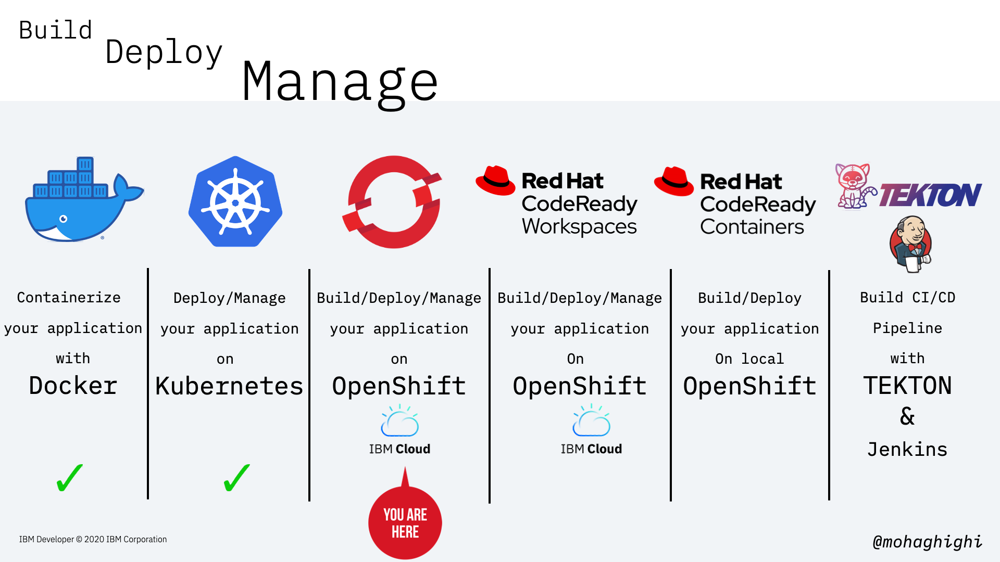
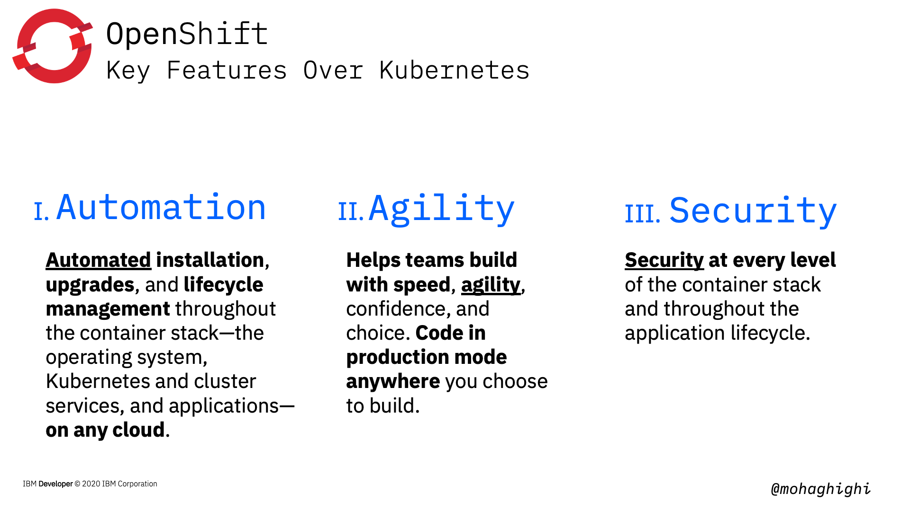
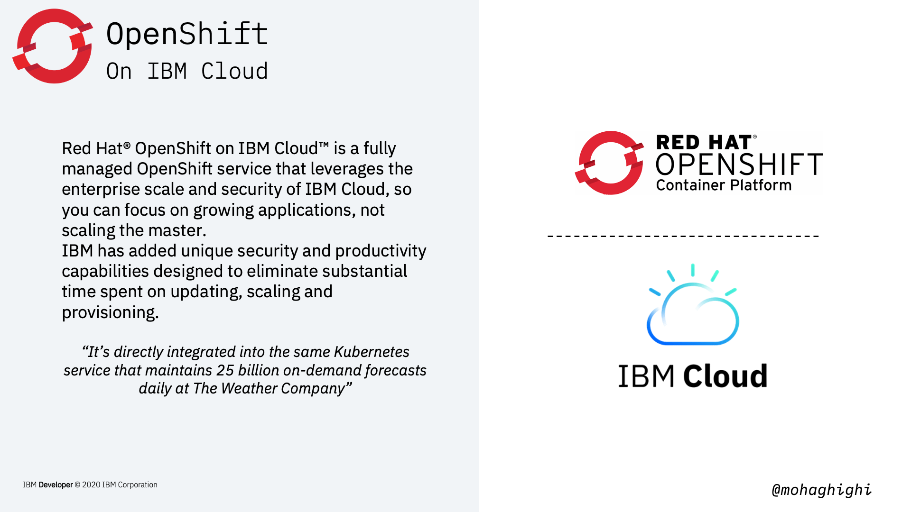
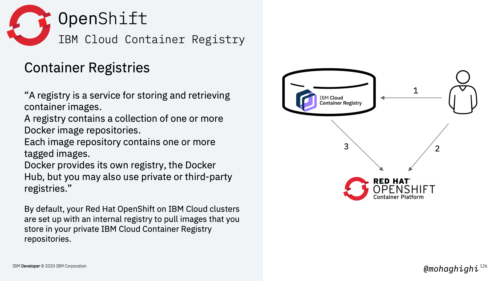
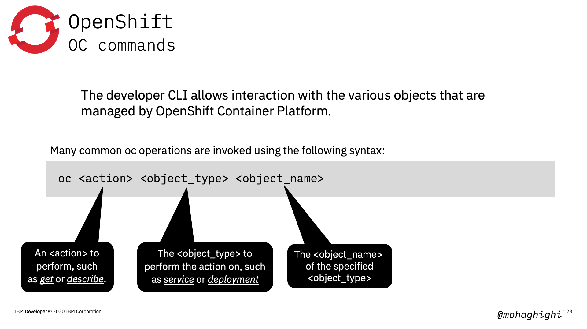

# Part 4: Build, Deploy and Manage your Microservices Application with OpenShift
  
[{style="width: 80%" .center}](https://youtu.be/ewj_jG4TgkE)
  
## Agenda

In this section you will learn:
- Why OpenShift?
- Kubernetes vs. OpenShift
- Developer productivity
- Deploy on OpenShift via CLI
    - Pushing image to registry
    - Create deployment
    - Expose 
- Deploy on OpenShift via Console
    - OpenShift Console
    - Builder Images
    - S2I (Source to Image)

{style="width: 80%" .center}

## What is OpenShift Container Platform?

{style="width: 80%" .center}

OpenShift is built on top of Kubernetes, and brings along all the brilliant features of Kubernetes, but it bundles Kubernetes with all the Essential features that will ultimately provide the best experience to both developers and Operation engineers.

But how does it achieve that?

Through a number of automated workflows, which are not available in Kubernetes.

Those automated workflows are the results of these components that are drawn in this diagram.

Kubernetes is wrapped around an enterprise-grade linux operating system (RHEL/CoreOS), Networking, monitoring, registry, and more importantly, authentication and authorisation.

## 3 x key features of OpenShift over Kubernetes. Automation, Agility and Security.

{style="width: 80%" .center}

## what are the automated workflows?

{style="width: 80%" .center}

- As a developer you want to get started on coding as quickly as possible, rather than spending time learning about different platforms, tools and services, and how to refactor your application based on them. 

Pre-created quick start application templates to build your application, based on your favourite languages, frameworks, and databases, with one click.

- As a developer you want to focus on coding and not worrying about what's going to happen in the background.

Deploying to OpenShift is as easy as clicking a button or entering a **git push** command, **enabling continuous integration**, managing builds, and allows you to fully control the deployment lifecycle.

- As a developer you want to build and test your application locally, without worrying about the openshift cluster your application will end up running in.

Develop container-based applications in the cloud or locally using the Red Hat CodeReady Containers to create a fully-functioning OpenShift instance **on your local machine**. Then, deploy your work to any OpenShift cluster.

{style="width: 80%" .center}

As this figure shows developers can focus on coding, and the rest of the process is taken care of by OpenShift's S2I or Source to Image. Building your image, deploying, and as you will later in part 7, continues integration.

## Three major differences between Kubernetes and OpenShift

### CLI vs. Console

{style="width: 80%" .center}

One of the most distinctive features of OpenShift is its amazing web console that allows to implements almost all tasks from a simple graphical interface. As you saw in the previous lab, Kubernetes dashboard is only good for displaying the status of your resources. You can't deploy, control or manage your applications, networking or any of those form Kubernetes dashboard.  Obviously, managed Kubernetes on different cloud platforms, come with different set of functionalities as add-ons.  But with Openshift container platfomr, the offered functionalities through the openshift console are vast. You can build, deploy, expose, update, and almost implement any task in two separate perspectives of developer and administrator. We'll go through that later in this lab.  

### Project vs. Product

{style="width: 80%" .center}

Kubernetes is an opensource project, where as Openshift is a product based on an open source project, which is Kubernetes Origin Distribution or OKD. [next] Comparing Kubernetes with OpenShift is like that classical example of comparing an engine with a car. You can't do much with an engine, and you need to assemble it with other components in order to get from A to B and become productive. What you get with OpenShift includes enterprise support, ecosystem certification And most importantly, regular releases and security updates at every level of the container stack and throughout the application lifecycle. That is an opinionated integration of features to simplify and secure your applications.

### Cloud Platforms Offerings

{style="width: 80%" .center}

Kubernetes offerings differ from one platform to another. Almost every major cloud provider offers a different flavour of Kubernetes. You get different sets of add-ons, plug-in and set of instructions for connecting your application to your cloud resources, which in most cases are only applicable to that particular platform. With openshift container platform, your experience and the way you interact with with the platform, let's say the openshift console, stays the same. Therefore, building, deploying and managing applications with Openshift container platform is truly: build it once and deploy it anywhere.

{style="width: 80%" .center}

In this lab we're going to use managed openshift on IBM Cloud. Before continuing, let's get started by provisions an OpenShift cluster on IBM Cloud.  
Red Hat® OpenShift on IBM Cloud™ is a fully managed OpenShift service that leverages the enterprise scale and security of IBM Cloud, so you can focus on growing applications, not scaling the master.

IBM has added unique security and productivity capabilities designed to eliminate substantial time spent on updating, scaling and provisioning.

{style="width: 80%" .center}

Once you've signed up on IBM Cloud and sign into your account by visiting cloud.ibm.com, you need to navigate through ibm cloud dashboard and choose OpenShift. Then go ahead and create your cluster. Once your cluster is provisioned and ready, it'll be listed in this table.

## Download and Install prerequisites

Install IBM CLI tools

``` bash
curl -sL https://ibm.biz/idt-installer | bash
```

Download OC CLI based on local OS and OpenShift version

``` bash
https://mirror.openshift.com/pub/openshift-v4/clients/oc/
```

Download kubectl

``` text
https://storage.googleapis.com/Kubernetesrelease/release/v1.17.7/bin/darwin/amd64/kubectl
```

Set your environmental parameters for OC

``` bash
mv /<filepath>/oc /usr/local/bin/oc
```

Set your environmental parameters for kubectl

``` bash
mv /<filepath>/kubectl/usr/local/bin/kubectl
```

## Login to IBM Cloud and check your installed plugins

Login to IBM Cloud

``` bash
ibmcloud login
```

if using a federated account

``` bash
ibmcloud login --sso
```

List IBM Cloud plugins

``` bash
ibmcloud plugin list
```

List IBM Cloud Openshift clusters

``` bash
ibmcloud oc cluster ls
```

Initialize OC CLI Client

``` bash
ibmcloud oc init
```

Log your local Docker daemon into the IBM Cloud Container Registry

``` bash
ibmcloud cr login
```

Test your OC CLI

``` bash
ibmcloud oc
```

Test your Container Registry

``` bash
ibmcloud cr
```

{style="width: 80%" .center}

## Push Image to IBM Container Registry

Create a new namespace in IBM Cloud Container Registry

``` bash
ibmcloud cr namespace-add [namespace]
```

Tag the image

``` bash
docker tag [image name] us.icr.io/[namespace]/[image name]
```

Push the image to container registry

``` bash
docker push us.icr.io/[namespace]/[image name]
```

List images in IBM Cloud Container Registry

``` bash
ibmcloud cr image-list
```

## OC commands

The developer OC CLI allows interaction with the various objects that are managed by OpenShift Container Platform. 

Here is the format of OC commands, almost identical with Kubectl

``` bash
oc <action> <object_type> <object_name>
```

{style="width: 80%" .center}

View existing projects

``` bash
oc projects
```

Switch to a project

``` bash
oc project [project name]
```

Create a new project

``` bash
oc new-project [name project]
```

## Some useful OC commands

Get the full list of OC commands and parameters

``` bash
oc --help
```

In-depth look into the values to be set

``` bash
oc explain [resource]
```

Edit the desired object type

``` bash
oc edit <object_type>/<object_name>
```

Updates one or more fields of an object (The changes is a JSON or YAML expression containing the new fields and the values)

``` bash
oc patch <object_type> <object_name> -p <changes>
```

## Create Deployment using an image from IBM Cloud Container Registry

Create a deployment by instructing the OpenShift cluster to pull an image from ICR

``` bash
oc create deployment [dep name] --image=us.icr.io/covid-test/myapp:v1
```

Get the list of deployments (same as Kubectl)

``` bash
oc get deployment
```  

Get the list of pods (same as Kubectl)

``` bash
oc get pods
```

## Expose the current deployment to the Internet

Expose the deployment on container port 8082 with LoadBalancer service type

``` bash
oc expose deployment/mytestservice --port=8082 --type=LoadBalancer
```

Get the list of services

``` bash
 oc get services
```

{style="width: 80%" .center}

Every OpenShift project has a Kubernetes service account that is named **default**. Within the project, you can add the image pull secret to this service account to grant access for pods to pull images from your registry.

## Pull Images from ICR into non-Default Projects

- Create an IBM Cloud IAM service ID for your cluster that is used for the IAM policies and API key credentials in the image pull secret.
- Create a custom IBM Cloud IAM policy for your cluster service ID that grants access to IBM Cloud Container Registry.
- Create an API key for the service ID
- Create an image pull secret to store the API key credentials in the cluster project
- Store the registry credentials in a Kubernetes image pull secret and reference this secret from your configuration file.
- Add the image pull secret to your default service account.

Create an IBM Cloud IAM service ID

``` bash
ibmcloud iam service-id-create cluster-project-id --description "service ID for cluster-project"
```

Create a custom IBM Cloud IAM policy for your cluster service ID

``` bash
ibmcloud iam service-policy-create iam-service-id --roles Manager --service-name container-registry
```

Create an API key for the service ID

``` bash
ibmcloud iam service-api-key-create [api-key-name] [service-policy-id] --description "API Key"
```

Create an image pull secret to store the API key & store the registry credentials in K8s image pull secret

``` bash
oc --namespace [project] create secret docker-registry [secret name] --docker-server=us.icr.io --docker-username=iamapikey --docker-password=[API-key] --docker-email=[]
```

Get all secrets in project

``` bash
oc get secrets --namespace [project]
```

Get secrets in 'default' serviceaccount in project []

``` bash
oc describe serviceaccount default -n [project]
```

Add the image pull secret to your default service account

``` bash
oc patch -n <project_name> serviceaccount/default --type='json' -p='[{"op":"add","path":"/imagePullSecrets/-","value":{"name":"<image_pull_secret_name>"}}]'
```

Check the secrets again to verify the secret has been added the default serviceaccount.

Get secrets in 'default' serviceaccount in project []

``` bash
oc describe serviceaccount default -n [project]
```

## Verify that the new project can pull images from ICR

Create a deployment by pulling an image from ICR into the new peoject

``` bash
oc create deployment [new project] --image=us.icr.io/covid-test/myapp:v1
```

verify that image has been pulled and deployed successfully

``` bash
oc get deployment
```

Expose the deployment

``` bash
oc expose deployment/mytestservice --port=8082 --type=LoadBalancer
```

Verify the service is up and running

``` bash
oc get services
```

## Scale and Replicas

in this section we will create replicas of our deployed application. Openshift will considers the instructed number of instances as the desired state. If any pod fails or destroyed, OpenShift will bring that back up to keep the number of instances intact in order to meet the load.

{style="width: 80%" .center}

Sclae the application by creating 3 more instances

``` bash
oc scale --replicas=4 deployment/[deployed resource]
```

Get the replicas

``` bash
oc get rs
```

Verify the number of running pods (reflecting the number of instances)

``` bash
oc get pods –o wide
```

## Rolling out updates and Rolling back

{style="width: 80%" .center}

Rolling updates allow Deployments' update to take place with zero downtime by incrementally updating Pods instances with new ones. Performing updates without affecting application availability.

{style="width: 80%" .center}

In this part we're going to update our image to the parser for covid-19 mortality data reflect the number of death in every country country and region.

``` bash
oc set image deployment/[deployment name] [container]=[new image]
```

Make sure you use the container name in the above command to update the image in it.

To get the container name, use:

``` bash
oc get deployment -o wide
```

verify the deployment is updated by pinging the app

``` bash
curl ip:port/hello/
curl ip:port/get/country/data/germany/
```

To rollback to the previous version use:

``` bash
oc rollout undo deployment/[deployment Name]
```

optional: You can add --to-revision=n in order to rollback to a specific version

``` bash
oc rollout undo deployment/[deployment Name] --to-revision=2
```

checkout the rollout status

``` bash
oc rollout status deployment/[deployment Name]
```

## Summary

{style="width: 80%" .center}
