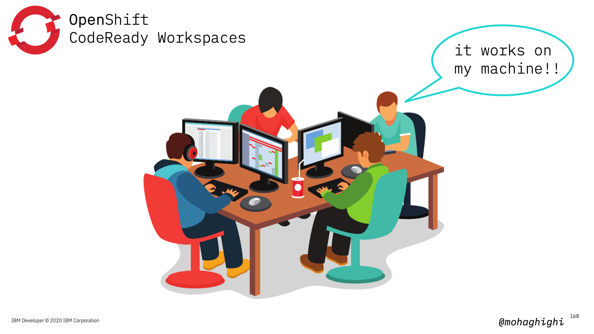
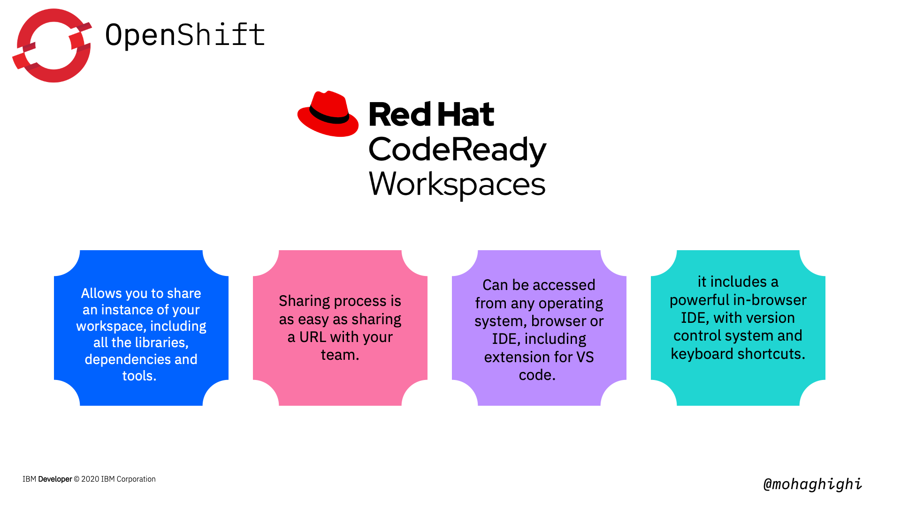
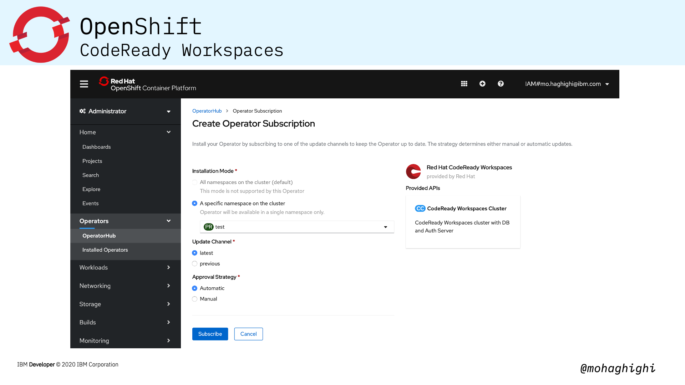
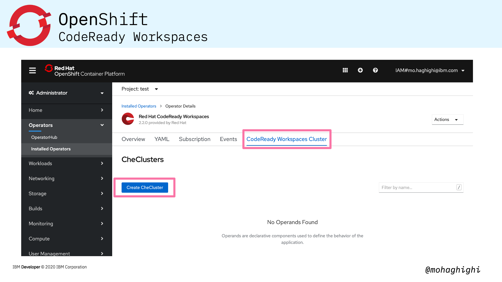
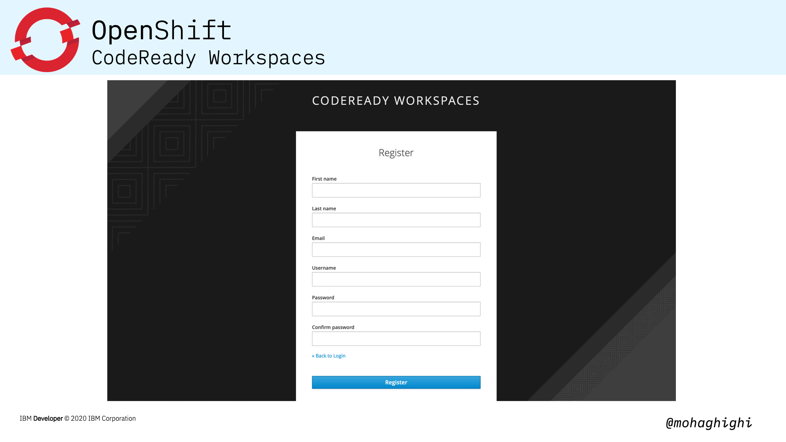
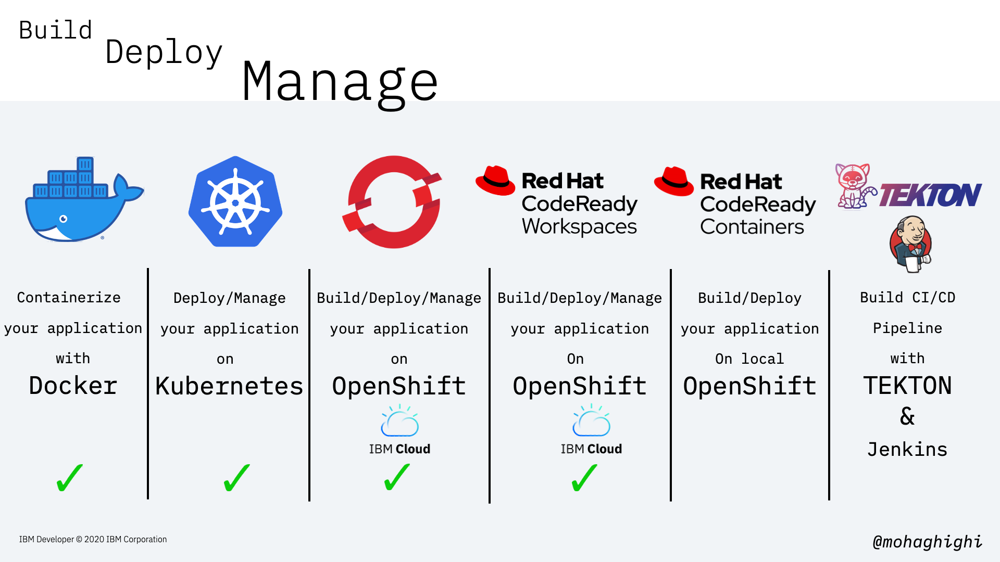

# Part 5: Build, Deploy and Share Your Applications with CodeReady Workspaces

In this lab we'll explore one of the most exciting features of OpenShift for developers. We'll explore how codeready workspaces helps teams build with speed, Agility, security and most notably code: in production from anywhere. And by anywhere, it truly means anywhere as we'll find out shortly.  

First We'll take a look at the key features of CodeReady Workspaces and we'll show you how to install code ready workspace in your OpenShift cluster. We'll discuss Operators and the operatorhub. Then we'll dive into our workspace to create a sample application from the in-browser IDE, and share the workspace with our team.  

Here's a quick revision of what we've learnt together so far - and how that fits into our learning journey throughout this course. We containerised our application with Docker, deployed and managed with Kubernetes and later with OpenShift CLI and Console. And now we're going to make it even easier to get started with coding from a browser. If you haven't watched the previous workshops, I highly encourage you to go ahead and review them. You get a clear idea about microservices, containerisation, orchestration, how openshift automates tedious tasks, and ultimately why codeready workspaces is such a fabulous solution for developers.

## Agenda

In this section you will learn:

- What is CodeReady workspaces?
- Install CodeReady Workspaces
    - Operators in OpenShift
    - OperatorHub
    - Install CRW Operator
    - Create CheCluster
- Your first workspace
    - Sample stacks
    - Import from Git
    - In-browser IDE
    - Compile/Run/Expose
- Workspace admin
- Share your Workspace

{style="width: 80%" .center}

Developers often spend too much time configuring their development environment, adding their libraries, dependencies and so forth.  It becomes even a bigger problem when developers are collaborating on a project. Let's say you develop an application on your machine, and it runs perfectly. but when others try to run it, all sorts of errors start showing up. And if you're working in a team, despite having kept your team well-aware of all the dependencies and libraries, collaborating on a project becomes a nightmare.  
You know that old saying : It works on my machine!!!

{style="width: 80%" .center}

CodeReady workspace offers a shared development environment for rapid cloud application development using Kubernetes and containers to provide a consistent and pre-configured developers environment to your teams.

{style="width: 80%" .center}

It is a cloud-native application environment that allows you to share an instance of your workspace, including all the libraries, dependencies and tools.

All you need to do is: add your libraries and dependencies, create a workspace instance and share that with your team members.

It is as easy as sharing a URL - called factory - with the rest of your team. clicking the URL will spin up a new workspace. This way your team will share the same runtime and same development environment.

But that's not all.. CodeReady Workspaces includes a powerful in-browser IDE, with all the features of modern IDEs including version control system and even keyboard shortcuts. You can also access it from any operating system, browser or IDE, including extension for VS code. 

{style="width: 80%" .center}

Installing CodeReady Workspaces in your OpenShift cluster is as simple as looking up its dedicated operator and installing from the OperatorHub within the OpenShift Console.

{style="width: 80%" .center}

Now let's explore Operators and the OperatorHub:

{style="width: 80%" .center}

## what is an operator?

updating and maintaining containerised applications should be an automated process. The same applies to your containerised development environment. Operators are small programs in your cluster that monitor your applications continuously and make sure they are running according to your instructions. When an operator detects a difference between the actual and the ideal states, it will act to correct it.

If you recall from workshop 3, we discussed how  Kubernetes master node continuously reconciles the expressed desired state and the current state of an object. And that is a controller in Kubernetes. Controller is a core concept in Kubernetes and is implemented as a software loop that runs continuously on the Kubernetes master node.

An Operator is essentially a custom controller.

The Operator is a piece of software running in a Pod on the cluster, interacting with the Kubernetes API server.

## What is the OperatorHub:

Operators are offered as pre-packaged modules from the operatorhub. OpenShift 4 introduced the OperatorHub, and that is a catalog of applications that can be installed by the administrator and added to individual projects by developers.

{style="width: 80%" .center}

As we mentioned, Codeready workspaces is offered as a dedicated operator from the openshift Operatorhub.

Regardless of where you have your open shift cluster running, Codeready workspace runs as a pod inside your cluster.

Therefore workspaces are maintained and updated by an operator and you can rest assured that your development environment is always available and running according to your requirement.

Underneath each workspace is a stack, a container image that includes language runtimes, compilers, tools, and utilities. Red Hat CodeReady Workspaces ships with stacks for many different languages. Stacks can go beyond just language support, however. A stack can contain multiple containers, allowing you to code in a replica of your production environment.

## Install CodeReady Workspaces

{style="width: 80%" .center}
{style="width: 80%" .center}
{style="width: 80%" .center}
{style="width: 80%" .center}
{style="width: 80%" .center}
{style="width: 80%" .center}
{style="width: 80%" .center}
{style="width: 80%" .center}
{style="width: 80%" .center}
{style="width: 80%" .center}
{style="width: 80%" .center}
{style="width: 80%" .center}

## Summary

{style="width: 80%" .center}
{style="width: 80%" .center}
