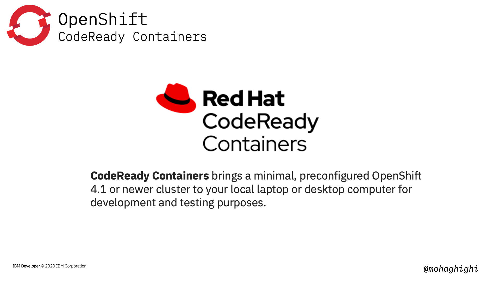
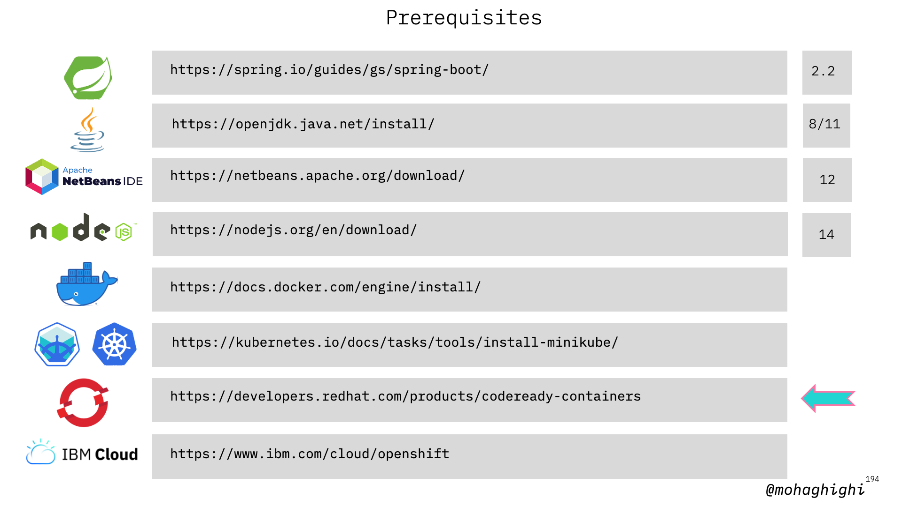
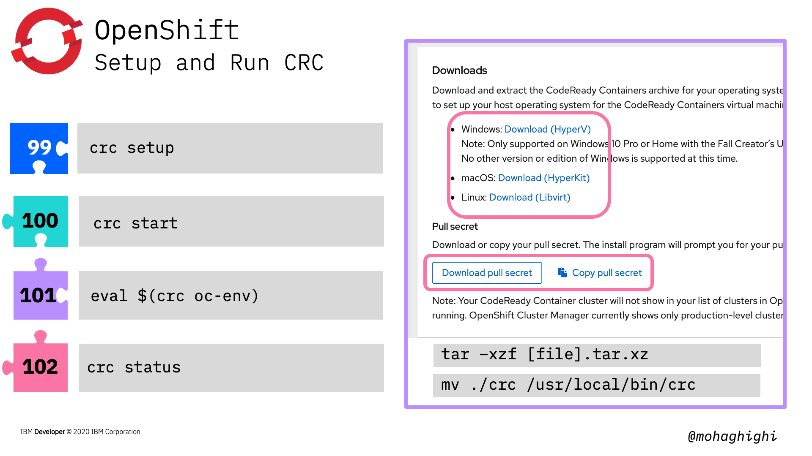
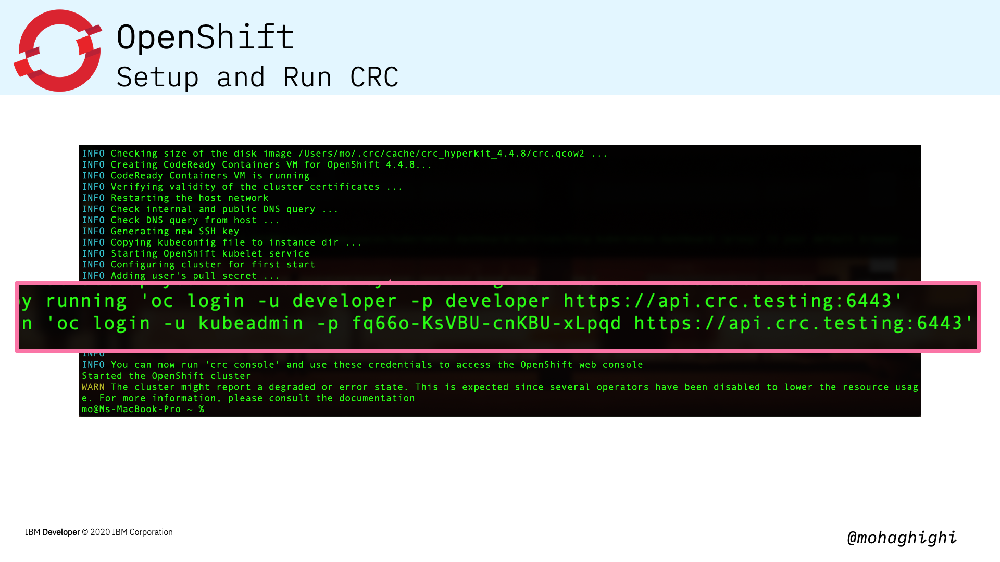
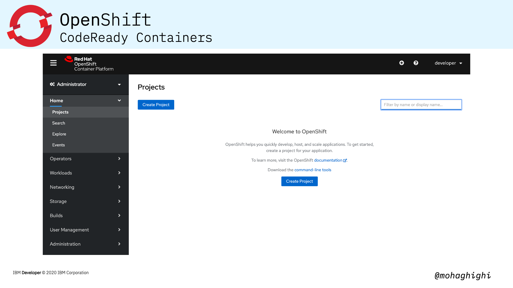

# Part 6: Build, and Test Your Applications with CodeReady Containers

{style="width: 80%" .center}

CodeReady Containers brings a minimal, preconfigured OpenShift 4.x to your local laptop or desktop computer for development and testing purposes. CodeReady Containers is delivered as a Red Hat Enterprise Linux virtual machine that supports native hypervisors for Linux, macOS, and Windows 10.  
CodeReady Containers is the quickest way to get started building OpenShift clusters. It is designed to run on a local computer to simplify setup and testing, and emulate the cloud development environment locally with all the tools needed to develop container-based apps. 
  
## Agenda

In this section you will learn:

- What is CodeReady Containers?
    - Install & Setup
    - Start CodeReady Containers
- Build on CodeReady Containers
    - From Git
    - From Templates
    - From Containers
    - From Dockerfile
- Deploy with Source to Image from the console
- View our resources from the CLI  

Download CodeReady Containers (CRC) from this link after signing up for a Red Hat Developer account.

{style="width: 80%" .center}
  
Once CRC is downloaded, set it up by following these commands:
 
 ``` bash
 crc setup
 ```

Then start your CRC:

 ``` bash
 crc start
 ```

You will be asked to enter your **pull secret**. Retrieve it form your Red Hat account:

{style="width: 80%" .center}

Once CRC starts, you will be provided with dedicated URLs to log into your CRC webconsole as an admin or developer:

{style="width: 80%" .center}

You will need the username and password in order to log into the web console.

{style="width: 80%" .center}

If you want to carry on using the CLI tool, make sure you've set your environmental parameters to interact with CRC using OC commands:

``` bash
eval $(crc oc-env)
```

some extra options to include in your CRC:  

You can define your allocated resources by adding options to control the number of CPU cores, memory and the Hypervisor used by CRC

``` bash
crc start --cpus [cpu cores] --memory [mib] --vm-driver [vm]
```

by default CRC loads this way

``` bash
crc start --cpus [4] --memory [8192] --vm-driver [hyperkit]
```

To stop CRC

``` bash
crc stop
```
